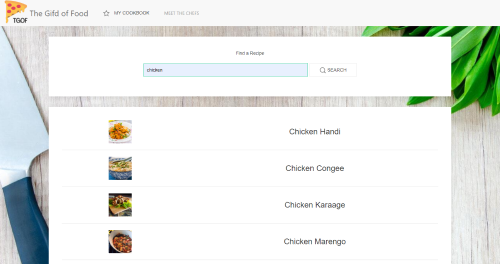
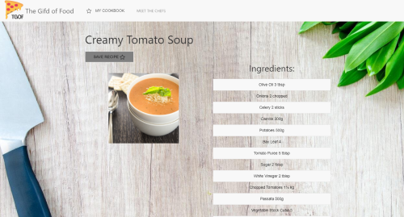
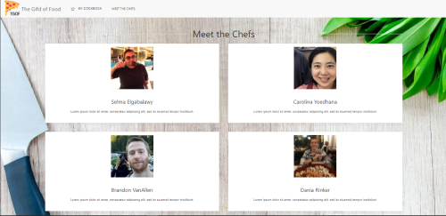

# Project 1 - The Gifd of Food

## Description 
The Gifd of Food is a web application that allows a user to search for a recipe. They will be prompted to choose a recipe from the dropdown of suggested recipes that match their search criteria. Once selected, they will be navigated to the recipe page for details on how to cook this recipe (ingredients and instructions will be provided). They will also be met with some gifs of their recipe. They can use they gifs as additional resources for what their meal should look like, or look at it for a lighthearted laugh. They will also have the ability to star or favorite their recipe for a chance to save it into their 'My Cookbook' dropdown on the navigation bar. This way they can reference their saved recipes at any point to go back and forth. Additionally, we created a 'Meet the Chefs' page that allows you to meet the team and some of their favorite meals. Who wants to read through a novel of a chef's blog before reaching the actual recipe you need? Nobody.

The entire application was built on two CSS frameworks, Swiper JS and UI Kit. It was built using API endpoints from Meal DB and Giphy.

One of the biggest challenges we faced in the frontend, was utilizing the grid on UI Kit for our "meet the team" page. From the perspective of the backend, it was toughest pulling the ingredients list from the Meal DB API. The name of the ingredients were accessed in different places than the measurements, so we needed to consolidate multiple lines of information into concise one line ingredient steps.

In the future we hope to implement better API endpoints that provide better data. We were quite limited since we had to use API's with no Oauth or CORS that were also free.

## A couple of things our team learned:
* Using git status often is very important to know what you are choosing to stage for commit
* We learned how to create GitHub branches and pull requests
* Media queries
* Utilized a new CSS Framework (UIkit) besides Bootstrap
* When running into merge conflicts, we synced as a group to address them one by one so that the conflicts would not escalate.
* Making all changes in develop was important, as well as restricting develop to require one approval prevented mistakes from happening

## Installation
* If you need to pull our code for this project, please visit our Github repository at: https://github.com/CarolinaYo/the-gifd-of-food
* If you need to see our deployed webpage for our code, please visit our hosted website at: https://carolinayo.github.io/the-gifd-of-food/ 

## Usage 
### Search Page

### Recipe 1

### Recipe 2

### Step 4

## Collaborators
* Brandon VanAllen https://github.com/BrandonVA (Backend)
* Selma Elgabalawy https://github.com/selma-e (Frontend, Project Manager)
* Dania Rinker https://github.com/daniarinker (Frontend)
* Carolina Yoedhana https://github.com/CarolinaYo (Backend)

## Third-Party Assets/Resources
* CSS Web Framework https://getuikit.com/
* Image Swiper https://swiperjs.com/
* The Meal DB https://www.themealdb.com/api.php
* Giphy https://developers.giphy.com/docs/api
* JQuery CDN http://code.jquery.com/
* Logo Creator https://www.canva.com/
* Background Image Credit https://www.pexels.com/photo/board-bunch-cooking-food-349609/
* Media Query https://www.w3schools.com/css/css_rwd_mediaqueries.asp

© 2020 | UW-SEA-FSF-PT-08-2020-U-C-TTh

